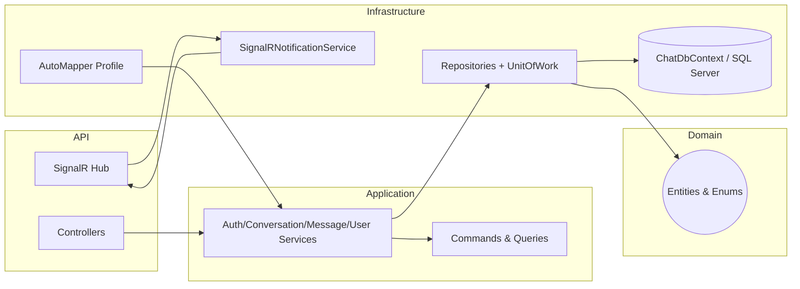
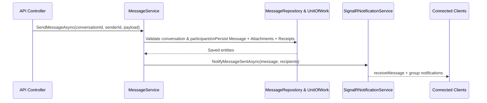

# Chatty.BE

> Backend for a real-time messaging experience built with ASP.NET Core, CQRS-inspired services, Entity Framework Core, and SignalR.

## Table of Contents
- [Chatty.BE](#chattybe)
  - [Table of Contents](#table-of-contents)
  - [Overview](#overview)
  - [Architecture](#architecture)
    - [Solution Layout](#solution-layout)
    - [Layer Responsibilities](#layer-responsibilities)
    - [Architecture Diagram](#architecture-diagram)
    - [Message Flow](#message-flow)
  - [Core Features](#core-features)
  - [Technology Stack](#technology-stack)
  - [Configuration](#configuration)
    - [Environment Variables](#environment-variables)
    - [Secrets \& Connection Strings](#secrets--connection-strings)
  - [Local Development](#local-development)
    - [Prerequisites](#prerequisites)
    - [Database Setup](#database-setup)
    - [Build \& Run](#build--run)
    - [Swagger \& API Exploration](#swagger--api-exploration)
    - [SignalR Hub](#signalr-hub)
  - [Testing](#testing)
  - [CI/CD](#cicd)
  - [Frontend](#frontend)

## Overview
Chatty.BE is a layered .NET 10 solution that demonstrates a modular backend for chat applications. The system exposes REST APIs, real-time push notifications via SignalR, and a clean separation between Domain, Application, Infrastructure, and API layers. Patterns such as repositories, unit of work, CQRS-style DTOs, and service abstractions keep the code base testable and easy to evolve.

## Architecture
The backend is organized as a classic Onion/Hexagonal layout. Inner layers (Domain and Application) know nothing about outer technical details, while Infrastructure wires implementation details such as persistence, mappings, and SignalR hubs.

### Solution Layout
```text
Chatty.BE/
|-- Chatty.BE.Domain/                # Entities, enums, and validation attributes
|-- Chatty.BE.Application/           # DTOs, contracts, and service implementations
|-- Chatty.BE.Infrastructure/        # EF Core DbContext, repositories, mappings, SignalR
|-- Chatty.BE.API/                   # ASP.NET Core Web API entry point & controllers
|-- Tests/
|   |-- Chatty.BE.Domain.Tests/      # Entity-focused unit tests
|   |-- Chatty.BE.Application.Test/  # Service tests (xUnit + Moq)
|   `-- Chatty.BE.Infrastructure.Tests/ # EF-backed repository specs
`-- .github/workflows/               # GitHub Actions pipeline
```

### Layer Responsibilities
| Layer | Responsibilities | Key Namespaces |
| --- | --- | --- |
| **Domain** | Core entities (`User`, `Conversation`, `Message`, `MessageAttachment`, `MessageReceipt`) and enums (`MessageStatus`, `MessageType`). Validation is mostly via data annotations. | `Chatty.BE.Domain.Entities`, `Chatty.BE.Domain.Enums` |
| **Application** | Contracts (`Interfaces.Repositories`, `Interfaces.Services`), DTOs for commands/queries (e.g., `GetConversationsForUserQuery`, `SendMessageCommand`), and services (`AuthService`, `ConversationService`, `MessageService`, `UserService`). Applies business rules such as participant validation, duplicate checks, and password hashing. | `Chatty.BE.Application.*` |
| **Infrastructure** | EF Core DbContext (`ChatDbContext`), entity configurations, repository implementations, AutoMapper profile, `UnitOfWork`, and SignalR messaging through `ChatHub` and `SignalRNotificationService`. Dependency injection is centralized in `InfrastructureServiceRegistration`. | `Chatty.BE.Infrastructure.*` |
| **API** | ASP.NET Core Web API host (`Program.cs`), controller endpoints, Swagger configuration, and SignalR hub registration. Currently contains a sample controller; more endpoints can be added that call Application services via DI. | `Chatty.BE.API` |
| **Tests** | Independent test projects per layer ensure fast feedback. Application tests mock repositories with Moq to validate service behavior, Infrastructure tests use EF Core InMemory provider, and Domain tests cover entity invariants. | `Tests/*` |

### Architecture Diagram


### Message Flow
The Send Message use case blends synchronous persistence with asynchronous SignalR notifications.



## Core Features
- **Authentication** – Registration, login (email or user name), and password changes with PBKDF2 hashing plus duplicate safeguards.
- **User Directory** – Fetch by id/email/username, keyword search, and profile updates with trimming & optional fields.
- **Conversations** – Private and group conversation workflows, participant management, membership checks, and transaction-backed creation.
- **Messaging** – Sending messages with attachments, tracking read receipts, unread counts, and conversation `UpdatedAt` updates.
- **Real-time Notifications** – SignalR hub broadcasting message, read receipt, and participant events.
- **Persistence Layer** – Repository + Unit of Work abstractions on top of EF Core with SQL Server provider and AutoMapper integration.
- **Automated Testing** – xUnit suites for domain models, services (Moq), and repository logic (EF Core InMemory).

## Technology Stack
| Category | Technologies |
| --- | --- |
| Runtime | .NET 10, ASP.NET Core minimal hosting |
| API Tooling | Swashbuckle (Swagger UI/OpenAPI), Microsoft.AspNetCore.OpenApi |
| Persistence | Entity Framework Core 10, SQL Server provider, Fluent configurations, EF migrations |
| Data Access Patterns | Repository pattern, Unit of Work, AutoMapper |
| Real-time | SignalR Hub + strongly typed `IChatClient` |
| Testing | xUnit, Moq, Microsoft.NET.Test.Sdk, coverlet.collector |
| CI/CD | GitHub Actions (`dotnet-auto-unit-test.yml`) running restore → build → test with code coverage |

## Configuration

### Environment Variables
| Variable | Description | Default |
| --- | --- | --- |
| `ASPNETCORE_ENVIRONMENT` | Hosting environment flag controlling Swagger/UI and configuration binding. | `Development` |
| `DEFAULT_CONNECTION` | SQL Server connection string consumed by `ChatDbContext`. | Defined in the local `.env` file |
| `Logging__LogLevel__*` | Standard ASP.NET Core logging knobs. | See `appsettings*.json` |

### Secrets & Connection Strings
1. Create a `.env` file at the repository root (a template is shown below) and set `DEFAULT_CONNECTION` to your SQL Server instance.
2. The API bootstrapper loads the `.env` file automatically via `DotNetEnv` and forwards the value to `ConnectionStrings:DefaultConnection`.
3. For production, **do not** store connection strings in source. Use platform-managed secrets (Key Vault, AWS Secrets Manager, etc.).
4. Ensure the SQL Server user has rights to create the `ChattyDb` database if you plan to run migrations locally.

Example `.env`:
```bash
DEFAULT_CONNECTION="Server=localhost\\SQLEXPRESS;Database=ChattyDb;Trusted_Connection=True;TrustServerCertificate=True;"
```

## Local Development

### Prerequisites
- [.NET SDK 10.0.x](https://dotnet.microsoft.com/en-us/download)
- SQL Server (Developer/Express/localdb) with access to create databases
- (Optional) Node/WebSocket client to test the SignalR hub
- PowerShell or Bash shell

### Database Setup
```bash
# From the repository root
dotnet tool install --global dotnet-ef   # if not already installed
dotnet restore
dotnet ef database update `
  --project Chatty.BE.Infrastructure/Chatty.BE.Infrastructure.csproj `
  --startup-project Chatty.BE.API/Chatty.BE.API.csproj
```
The command uses migrations under `Chatty.BE.Infrastructure/Migrations` to create/update the `ChattyDb` schema.

### Build & Run
```bash
# Restore once
dotnet restore Chatty.BE.sln

# Build everything
dotnet build Chatty.BE.sln

# Launch the API (with Swagger + SignalR hub)
dotnet run --project Chatty.BE.API/Chatty.BE.API.csproj
```
Navigate to `https://localhost:5001` (or the port shown in the console) after the API boots.

### Swagger & API Exploration
Swagger is automatically enabled in `Development`. Visit:
```
https://localhost:5001/swagger
```
Use the interactive UI to explore endpoints such as `/api/test` and any future REST resources added on top of the Application services.

### SignalR Hub
- Hub route: `/hubs/chat`
- Join logic: clients pass a `userId` query string or include a `sub` claim so `ChatHub` can place the connection into the appropriate user-specific group.
- Events pushed via `IChatClient`: `ReceiveMessage`, `MessagesRead`, `UserJoinedConversation`, `UserLeftConversation`.

## Testing
Each layer owns its own test suite under `Tests/`.

```bash
# Run every test project
dotnet test Chatty.BE.sln

# Focus on application services
dotnet test Tests/Chatty.BE.Application.Test/Chatty.BE.Application.Test.csproj
```
Application tests use Moq to validate repository interactions and AAA-style naming (`MethodName_ShouldExpected_WhenCondition`). Infrastructure tests rely on `Microsoft.EntityFrameworkCore.InMemory` for fast repository checks. Code coverage is collected via coverlet when invoked by CI.

## CI/CD
The GitHub Actions workflow `.github/workflows/dotnet-auto-unit-test.yml` runs on pushes and pull requests targeting `main` or `develop`:
1. Checkout source
2. Install .NET SDK 10
3. `dotnet restore` the solution
4. `dotnet build` in Release
5. `dotnet test` with XPlat code coverage enabled

Extend this pipeline with publishing, containerization, or deployment steps as the project matures.

## Frontend
A dedicated frontend is not included in this repository. Any web/mobile client can integrate by:
1. Using the REST API for CRUD operations (after new controllers are added).
2. Connecting to `/hubs/chat` via SignalR (JavaScript, .NET, Java, etc.) and joining the `userId` group to receive real-time updates.

Contributions for a companion UI are welcome; keep environments decoupled by isolating the frontend in a sibling repository or a `Chatty.FE` folder.
